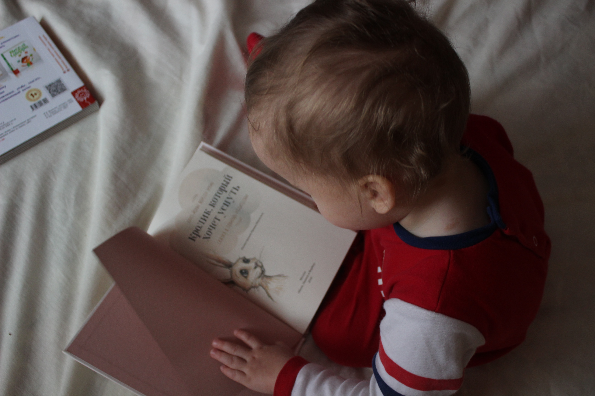

---
# Data Science Projects

---

## Project # 1: Data Explainiability Challenge 

Technolvers launched the #Data Explainability Challenge (DEC) to emphasize the importance of Data Science and Data Analytics for tackling real-world problems like the current COVID-19 pandemic. Participants were required to rank the top five regions of Pakistan from the Most Successful to the Most Struggling on the basis of the provided COVID-19 dataset.
Our team consisting of three members (Farhana Shafi, Rahat Ul Ain, Bia Chaudhry (Team Lead)), performed data analysis in four major steps. First, we implemented a time-series analysis to examine the region-wise trends of several factors. Then, we compared all the regions considering parameter ratios. Third, we drew insights from previous comparisons. And finally, we rated the top five regions.  #Alhumdullilah. We stood second runner-up in this all Pakistan DEC competition. Special thanks to Dr.Semaab Latif for mentoring us.
The details of our analysis can be found here: [Source Code](https://github.com/BiaChaudhry/DEC_Competition_COVID_19_Analysis/blob/master/Farhana_Rahat_Bia_DEC260411_Data_Video_Comp.ipynb)

---

## Project # 2: Reading Habit Analysis

I collected and analysed the data for getting the answer to the question: "What Motivates you to read?". I applied **Clustering & Decision Tree** approach to generate results. The details can be found in my medium blog: [Reading Habit Analysis - Medium Blog Post](https://medium.com/@biach1312/reading-habit-analysis-895f78865bb0). I used Kaggle kernel for the analysis. The source code can be found on Kaggle. [Source Code](https://www.kaggle.com/biach1312/kernel-reading-habit-analysis). You are very welcome to use the dataset as well as improve these results. It can be used to create an **End-to-End** system to motivate users to read. 

---

## Project # 3: Similarity between Documents

Using **NLP** techniques I found the similarity between several documents. The processes I used include: 
  1. TF-IDF
  2. Cosine-similarity
  3. Soft-Cosine-Similarity
  4. Fasttext Word Embeddings
  5. Clustering : Dendograms
  6. Visualization : Network Graph
  7. Evaluation Metric : Accuracy
The detailed code with further explanation can be found here: [Code & Description](https://github.com/BiaChaudhry/Document_Similarity_NLP/blob/master/NLP_Project_Bia_Chaudhry_184055_SimilarityBetweenDocuments.ipynb)
The Presentation of this project can be found here: [Presentation](https://github.com/BiaChaudhry/Document_Similarity_NLP/blob/master/Bia_Chaudhry_ProjectPresentation.pptx)

---

## Project # 4: Survey of Final Year Students to get insights

This project is more of a data analytical project. But you can always initiate a data science problem to find a solution. In this project I collected data from Final Year University students (mainly from my university NUST), when I was still in my final year. The survey aims at figuring out the sentiments of graduation class regarding several aspects of their univeristy and other experiences. The details of this project can be found in my blog post at: [Survey of Final Year Students](https://seblog1312.blogspot.com/2020/02/a-survey-of-final-year-university.html)

---

## Project # 5: Productivity Analysis amid Pandemic Situation

### INTRODUCTION:
This study is meant to provide a brief overview of how the productivity of different sectors effected amid the current pandemic situation.

### DATA:
The data is collected using Google Forms. Hence it is inserted in the form of CSV file to generate visualizations.
The CSV file contains the data in the form of structured rows and columns. Around 150 people participated in the data collection phase. This report contains a total of 5 pages only.

### TOOLS & TECHNOLOGIES:
The report and visualization charts are created using Google Data Studio.
Google Data Studio helps to create and manage analytical reports easily and effectively.

### RESULTS:
The graphical representations along with the description can be found in this report, showing several results and data insights. 

### INSIGHTS & FINDINGS:
From the current analysis, we can draw several insights such as:

  1. The male participants for this survey outnumbered the female participants.
  2. Out of all the participants, the major portion is covered by students.
  3. The reason for the above two conclusions is that the Google form reached that audience the most. 
  4. Overall productivity decreases.
  5. The reduction in productivity is due to non-familiarity with distance learning and work from home.

### CONCLUSION:
Conclusively I would say that such analysis allows us to better tackle the situation like current pandemic effectively, and enables us to use technology to move forward with maximum productivity. 
[FULL REPORT](https://drive.google.com/file/d/1PDK4uhh-YfA-P0YsmjMydbO4B5_ZCb-J/view?usp=drivesdk)

---

Happy Data Sciencing :)
